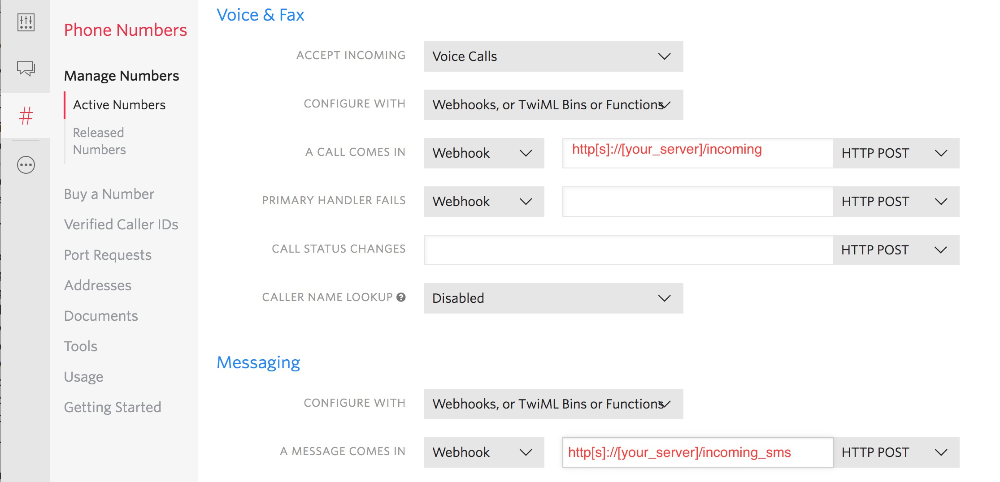
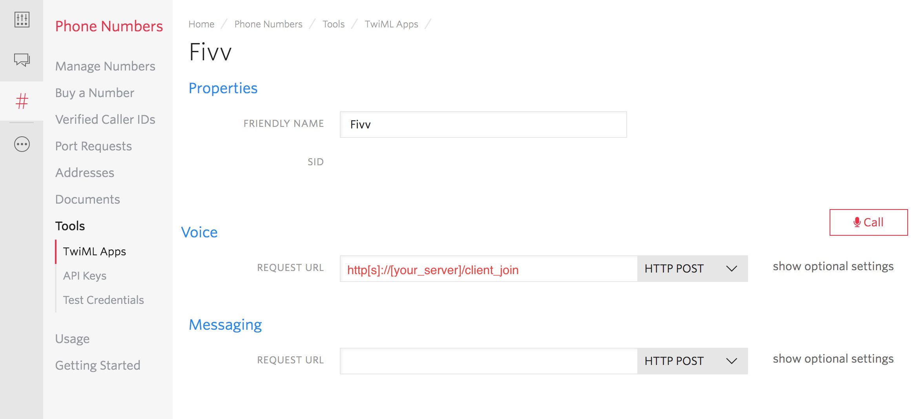

# Fivv
A twilio- and rails-powered voice conference scheduling and management system

Users can create an address book of their contacts, specifying each contact's name, mobile number, and time zone. Users can then schedule voice conferences and invite contacts from their address book to participate. Users can specify whether a conference is moderated, meaning that the conference will not begin (other participants will be put on hold) until the conference organizer joins. Participants can join the conference from five minutes before the scheduled start time until the scheduled end time.

When a conference is first scheduled, the organizer and all participants receive a text message with the conference details (in the participant's local time zone) and their login credentials, which are hashed and stored securely in a PostgreSQL database. Need to change the conference time? No problem - your participants will automatically be sent a text message with the updated details. Need to uninvite someone? Also not a problem - their login credentials will be revoked and they will receive a text message informing them that the conference was canceled.

For added security, Fivv will not allow the same login credentials to be used simultaneously to join a conference, but don't worry if a user gets disconnected or has to hang up for a few minutes - Fivv will detect that and allow them to rejoin the conference.

Fivv is currently configured to accept only North American phone numbers, but can easily be reconfigured to work with phone numbers in any country supported by Twilio.

[A trial demo](http://fivv.samhopkins.tech/) is available to test out. Trial accounts remain active for 48 hours, and conferences are limited to 15 minutes and ten participants.

## Configuration
The following environment variables need to be set in order to run Fivv:
  * **TWILIO_SID** - your Twilio account SID
  * **TWILIO_AUTH_TOKEN** - your Twilio auth token
  * **CONFIRMATION_NUMBER** - the administrator's mobile number - requests to confirm new trial accounts will be sent to this number
  * **TWILIO_NUMBER** - the Twilio phone number to use for the app
  * **TWILIO_TWIML_APP_SID** - Twilio TwiML app SID for web client
  
The following environment variable is optional:
  * **MAX_PARTICIPANTS** - specify a maximum number of participants for new conferences

Additionally, you will need to set up an account with Twilio, purchase a US or Canadian phone number, and set up one TwiML application in your Twilio console in order to run the application.

On the configuration page for your phone number, be sure the number is set to accept voice calls (rather than faxes). Incoming calls should be configured to send a post request to the /incoming route of the server your app is deployed to. Incoming text messages should be configured to send a post request to the /incoming_sms route of your server. Please see the image below as a guide.

On the configuration page for your TwiML app, be sure that incoming voice requests are set to send a post request to the /client_join route of your server. See the image below for an example.

  
